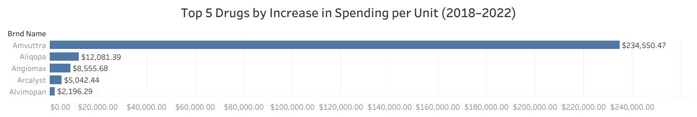
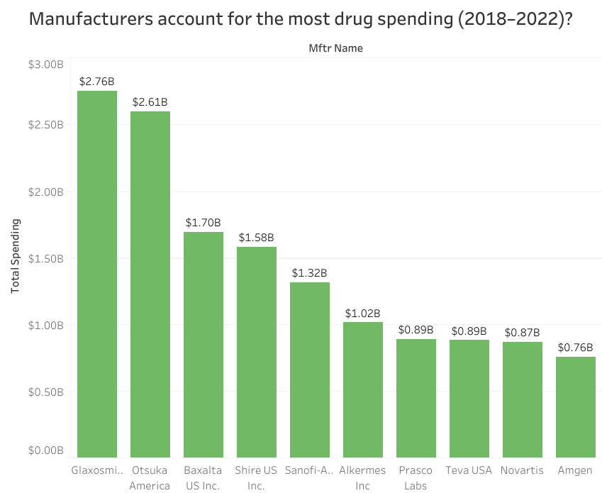
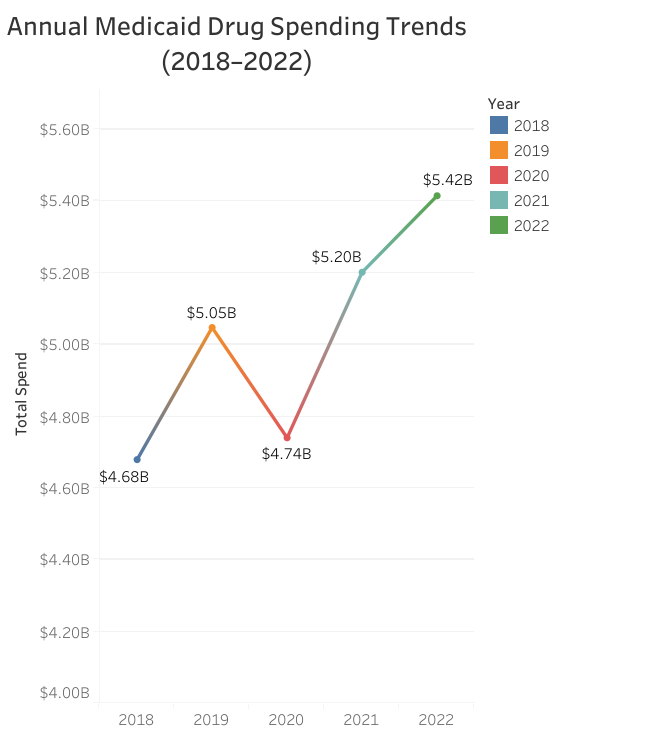

# medicaid-etl

# 📌Project Overview
This analysis will help State Medicaid Program Managers and P&amp;T Committees identify rapidly rising drug costs and prioritize cost containment strategies, while also informing rebate negotiators and policy analysts about high-impact manufacturers and therapeutic classes

> This project explores Medicaid drug spending trends in the United States from 2018 to 2022 using publicly available data. It identifies cost growth drivers, key manufacturers, and overall budget implications using SQL, Python, Excel and Tableau.

| Business Question                                                                                 | Why it matters                                                         | Stakeholders                             |
| ------------------------------------------------------------------------------------------------- | ---------------------------------------------------------------------- | ---------------------------------------- |
| **Which drugs had the largest increase in spending per unit (2018–2022)?**                        | Identifies drugs driving Medicaid cost growth                          | Medicaid program managers, policy makers |
| **Which manufacturers account for the most Medicaid drug spending?**                              | Highlights manufacturer concentration & negotiation leverage           | Procurement teams, policy makers         |
| **Has total Medicaid drug spending increased/decreased over time?**                               | Evaluates overall budget impact                                        | Federal/state Medicaid leadership        |

# 📊Data Source
Dataset information:

Dataset: Medicaid Drug Spending (CMS)

Years Covered: 2018 to 2022

Source: [`data.medicaid.gov`](https://data.cms.gov/summary-statistics-on-use-and-payments/medicare-medicaid-spending-by-drug/medicaid-spending-by-drug/data)

# 🧰 Tools Used
Technologies:

* SQL (SQLite) – for querying and aggregating the data and verifying insights

* Tableau Public – for building dashboards and visualizations

* Excel – for data cleaning and pivot table experimentation/presentations

* Python/Jupyter Notebook - ETL

# 🗂️Data Preparation / ETL Summary

## Extraction
* The data was imported as a JSON object and converted to a structured DataFrame using pandas for easy analysis and visualization.
* The extraction process ensures that the analysis always uses the most up-to-date version of the CMS dataset.

## Transformation(Data Cleaning and Preparation)
The raw dataset from the CMS API was cleaned and prepared using Python in a Jupyter Notebook. The main goals were to ensure consistency in naming, fix data types, remove irrelevant information, and handle missing values.

### 🔧 Key Steps Performed:
* Standardized Column Names

* All column names were converted to lowercase, stripped of whitespace, and special characters (like spaces) were replaced with underscores for easier referencing in code.

* Fixed Data Types

* Columns containing spending (spndng), averages (avg), and totals (tot) were explicitly converted to numeric types using pandas.to_numeric() to ensure they were ready for aggregation and analysis.

* Removed Irrelevant Columns

* Columns unrelated to the key business questions (e.g., total manufacturers, dosage units, claims, and per-claim averages) were dropped to streamline the dataset and focus only on per-unit cost metrics.

*Handled Missing Values, Null values in critical numeric fields were filled with 0, specifically in: Spending columns (spndng), Weighted averages (wghtd), General averages (avg). This ensured no nulls disrupted analysis or visualizations.

* Verified Cleanliness

* A final check using df.isnull().sum() confirmed that all relevant fields were properly cleaned and imputed.

## Load Phase

### 🔧 Key Steps Performed:
1. Exported to CSV: The cleaned DataFrame was saved as medicaid_drug_spending_cleanv2.csv to preserve a flat file version for portability and use in tools like Excel or Tableau.
2. To enable efficient SQL querying and structured storage, the DataFrame was loaded into a new SQLite database named medicaid_drug_spendingv2.db. A table called drug_spending was created (or replaced if it existed), and the cleaned data was inserted.
3. Confirmation: The process was completed without error, confirming that the dataset is now stored in both relational and flat file formats for flexibility in analysis and reporting.

# 🔍 Business Analysis Workflow
To answer key business questions related to Medicaid drug spending, I followed a multi-step analysis process combining SQL, Excel, and Tableau for layered validation and insight generation.

## 1. 🧠 SQL-Based Exploration
Before visualization, I used SQL queries on the cleaned dataset stored in SQLite to:
Aggregate and filter data to match each business question

Identify key metrics such as:

* Total Medicaid drug spending by year

* Top manufacturers by cumulative spending

* Drugs with the highest increase in spending per unit

* Validated that the dataset structure supported meaningful insights

Example:
To identify the top 5 drugs with the largest increase in spending per unit from 2018 to 2022, I wrote SQL queries that calculated the difference between per-unit spending columns and ranked the results in descending order.

## 2. 📊 Excel Pivot Tables for Quick Analysis
After initial SQL insights, I imported the cleaned data into Excel to:

Create pivot tables for dynamic filtering and aggregation

Perform sanity checks on SQL results (e.g., do the top manufacturers in Excel match those from SQL?)

Quickly compute metrics like averages, totals, and percentage changes using calculated fields

This step allowed me to prototype and cross-verify insights before final visualization.

## 3. 📈 Data Visualization with Tableau
With the validated insights from SQL and Excel, I used Tableau Public to create interactive visualizations that:

Showed trends in total drug spending over time

Highlighted the top manufacturers and drugs driving cost increases

Allowed for intuitive, visual storytelling suitable for business stakeholders

These visualizations made the insights accessible to non-technical audiences such as Medicaid program managers and policy makers.

## ✅ Outcome
By combining SQL for precision, Excel for flexibility, and Tableau for communication, I ensured that the analysis was:

Accurate (validated through multiple tools)

Exploratory (allowing iteration and discovery)

Insightful (translated into visuals for decision-makers)

### 📊 Excel Pivot Tables
The cleaned dataset was also explored using Excel pivot tables for dynamic filtering and cross-checking SQL results.

📂 [Open the Excel file on OneDrive](https://1drv.ms/x/c/eb266b9037d2a0a2/EUheQrZB5tJMj147cKxYaDEBGse-eDCcKdvbpOlfMG7m0w?e=U0eyft)

# 📈 Key Findings
Summarizing insights from each question:

## Q1: **Which drugs had the largest increase in spending per unit (2018–2022)?**

> Between 2018 and 2022, Amvuttra had the largest increase in Medicaid spending per dosage unit, rising by over $234,000. This was followed by Aliqopa ($12,081), Angiomax ($8,555), Arcalyst ($5,042), and Alvimopan ($2,196). These drugs represent the top drivers of per-unit cost growth during this period.

* Key Insight:
From 2018 to 2022, Amvuttra experienced a dramatic increase in Medicaid spending per dosage unit (+$234,550), far surpassing other drugs. Other high-growth drugs include Aliqopa, Angiomax, Arcalyst, and Alvimopan.

* Implication for Policy:
These findings can help guide rebate negotiations with manufacturers of high-cost drugs and trigger clinical or cost-effectiveness reviews. By identifying drugs with the steepest cost growth, Medicaid programs can pursue strategies to control future spending while maintaining patient access.

## Q2: **Which manufacturers account for the most Medicaid drug spending?**

This bar chart displays the top 10 manufacturers by total Medicaid drug spending between 2018 and 2022. It reveals a significant concentration of spending among a small number of companies:

* GlaxoSmithKline leads with $2.76 billion in spending.

* Otsuka America follows closely at $2.61 billion.

* Baxalta US Inc., Shire US Inc., and Sanofi-Aventis round out the top five, each exceeding $1.3 billion.

* The remaining manufacturers on the list (including Amgen, Teva USA, and Novartis) each account for $0.76B–$1.02B, still substantial.

Together, these ten companies represent a large portion of total Medicaid spending, indicating high manufacturer concentration.

> A small number of manufacturers drive the majority of Medicaid drug spending. GlaxoSmithKline and Otsuka alone account for over $5B in expenditures. These findings highlight key targets for rebate negotiations and formulary review, supporting procurement and policy teams in maximizing cost control.

## Q3: **Total Medicaid drug spending has steadily increased from 2018 to 2022, indicating growing budget impact.**

* Yes — total Medicaid drug spending has increased over time, showing overall growth despite a temporary dip in 2020.

* Spending rose from $4.68B in 2018 to $5.42B in 2022.

* This reflects a net increase of $0.74B, or about 15.8% over the 5-year period.

* After a slight drop in 2020 (likely due to COVID-19 disruptions), spending rebounded and reached its highest point in 2022.

> Medicaid drug spending increased by 15.8% from 2018 to 2022, rising from $4.68B to $5.42B. Although spending dipped in 2020, it quickly rebounded, indicating persistent upward pressure on the program’s pharmaceutical budget. Therefore, Policymakers must plan for continued growth in pharmaceutical expenditures and consider both market dynamics (e.g., drug launches, exclusivities) and utilization changes when setting future budgets.

# 🧩 Tableau Dashboard
Dashboard: 
> 📊 [View the Tableau Dashboard](https://public.tableau.com/views/RisingCostsKeyPlayersMedicaidDrugSpendingAnalysis2018-2022/Dashboard1?:language=en-GB&:sid=&:redirect=auth&:display_count=n&:origin=viz_share_link)

# 💡 Future Work
* Include therapeutic class breakdowns

* Analyze state-level Medicaid trends

* Explore cost-effectiveness using prescription volumes

* Create an interactive dashboard for a large scale insight collection

# 👤 Author
* Kwasi Dankwa
* Data Analytics Portfolio Project
* [`LinkedIn`](https://www.linkedin.com/in/kwasidankwa/) | [`Tableau Public`](https://public.tableau.com/app/profile/kwasi.dankwa/vizzes)

